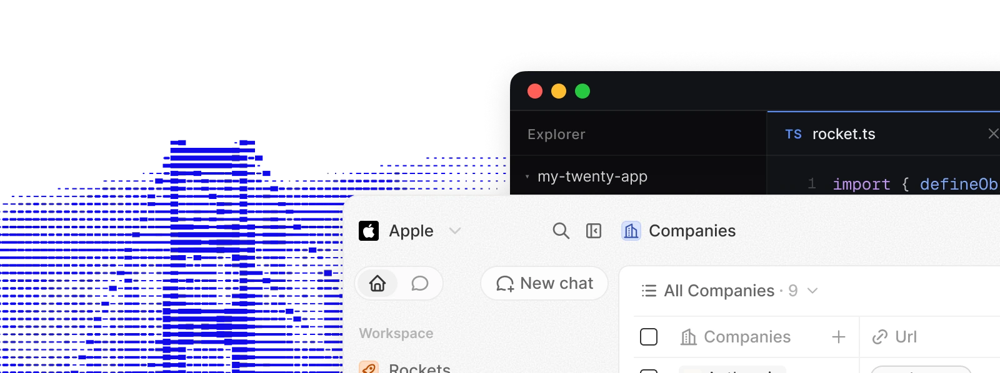
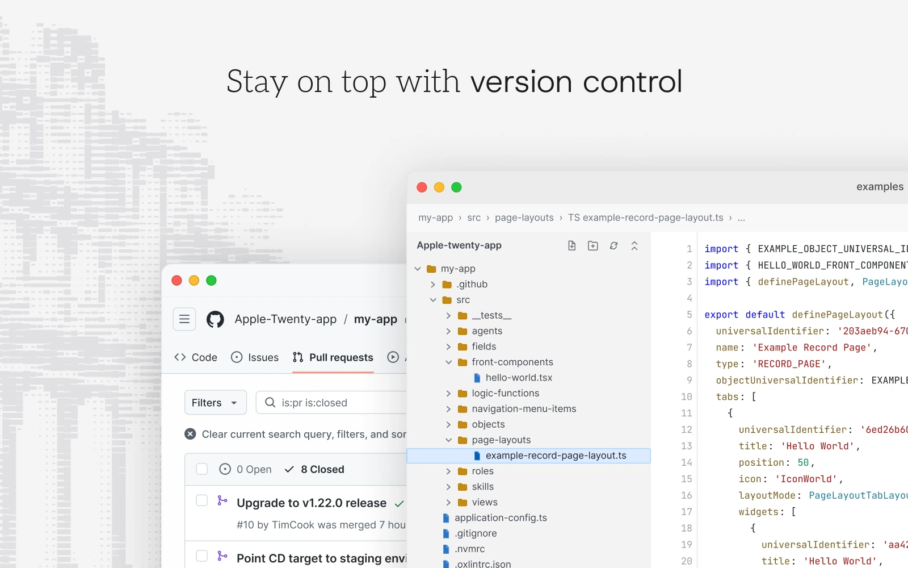
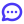

<p align="center">
  <a href="https://bades.id">
    
  </a>
</p>

<h2 align="center" >Sistem Informasi Desa Open Source</h2>

<p align="center"><a href="https://bades.id"> Website</a> · <a href="https://docs.bades.id"> Dokumentasi</a> · <a href="https://github.com/badesid/bades"> Roadmap </a> · <a href="https://discord.gg/badesid"> Discord</a></p>

<p align="center">
  <a href="https://bades.id">
    <picture>
      <source media="(prefers-color-scheme: dark)" srcset="./packages/website/public/images/readme/github-cover-dark.webp" />
      <source media="(prefers-color-scheme: light)" srcset="./packages/website/public/images/readme/github-cover-light.webp" />
      
    </picture>
  </a>
</p>

<br />

# Why Bades.id

Bades.id memberikan blok bangunan untuk Sistem Informasi Desa (SID) yang disesuaikan dengan kebutuhan pemerintahan desa dan dapat beradaptasi dengan cepat seiring perkembangan desa. Bades.id adalah SID yang Anda bangun, kirim, dan versioning seperti bagian lain dari stack Anda.

<a href="https://bades.id/resources/why-bades"> Pelajari lebih lanjut tentang mengapa kami membangun Bades.id</a>

<br />

# Instalasi

###  Cloud

Cara tercepat untuk memulai. Daftar di [bades.id](https://bades.id) dan buat workspace dalam waktu kurang dari satu menit, tanpa infrastruktur yang harus dikelola dan selalu terbaru.

###  Bangun aplikasi

Scaffold aplikasi baru dengan Bades CLI:

```bash
npx create-bades-app my-app
```

Definisikan objek, field, dan view sebagai kode:

```ts
import { defineObject, FieldType } from 'bades-sdk/define';

export default defineObject({
  nameSingular: 'layanan',
  namePlural: 'layanan',
  labelSingular: 'Layanan',
  labelPlural: 'Layanan',
  fields: [
    { name: 'name', label: 'Nama', type: FieldType.TEXT },
    { name: 'jumlah', label: 'Jumlah', type: FieldType.CURRENCY },
    { name: 'tanggal', label: 'Tanggal', type: FieldType.DATE_TIME },
  ],
});
```

Luego envíalo a tu espacio de trabajo:

```bash
npx bades app:publish --private
```

Consulta la [guía de desarrollo de aplicaciones](https://docs.bades.id/developers/extend/apps/getting-started) para objetos, vistas, agentes y funciones lógicas.

###  Self-hosting

Ejecuta Bades.id en tu propia infraestructura con [Docker Compose](https://docs.bades.id/developers/self-host/capabilities/docker-compose), o contribuye localmente a través de la [guía de configuración local](https://docs.bades.id/developers/contribute/capabilities/local-setup).

<br />
<br />

# Todo lo que necesitas

Bades.id te proporciona los bloques de construcción de un SID moderno (objetos, vistas, flujos de trabajo y agentes) y te permite extendarlos como código. Aquí hay un recorrido de lo que hay en la caja.

¿Quieres profundizar? Lee la <a href="https://docs.bades.id/user-guide/introduction"> Guía del Usuario</a> para tutoriales del producto, o la <a href="https://docs.bades.id"> Documentación</a> para referencia del desarrollador.

<table align="center">
  <tr>
    <td width="50%">
      <picture>
        <source media="(prefers-color-scheme: dark)" srcset="./packages/website/public/images/readme/v2-build-apps-dark.webp" />
        <source media="(prefers-color-scheme: light)" srcset="./packages/website/public/images/readme/v2-build-apps-light.webp" />
        
      </picture>
      <p align="center"><a href="https://docs.bades.id/developers/extend/apps/getting-started"> Más información sobre aplicaciones en docs</a></p>
    </td>
    <td width="50%">
      <picture>
        <source media="(prefers-color-scheme: dark)" srcset="./packages/website/public/images/readme/v2-version-control-dark.webp" />
        <source media="(prefers-color-scheme: light)" srcset="./packages/website/public/images/readme/v2-version-control-light.webp" />
        
      </picture>
      <p align="center"><a href="https://docs.bades.id/developers/extend/apps/publishing"> Más información sobre control de versiones en docs</a></p>
    </td>
  </tr>
</table>

<br />

# Stack

- <a href="https://www.typescriptlang.org/"> TypeScript</a>
- <a href="https://nx.dev/"> Nx</a>
- <a href="https://nestjs.com/"> NestJS</a>, dengan <a href="https://bullmq.io/">BullMQ</a>, <a href="https://www.postgresql.org/"> PostgreSQL</a>, <a href="https://redis.io/"> Redis</a>
- <a href="https://reactjs.org/"> React</a>, dengan <a href="https://jotai.org/">Jotai</a>, <a href="https://linaria.dev/">Linaria</a> dan <a href="https://lingui.dev/">Lingui</a>

<br />

# Bergabung dengan Komunitas

<p><a href="https://github.com/badesid/bades"> Berikan star repo</a> · <a href="https://discord.gg/badesid"> Discord</a> · <a href="https://github.com/badesid/bades/discussions"> Permintaan fitur</a> · <a href="https://x.com/badesid"> X</a> · <a href="https://www.linkedin.com/company/badesid/"> LinkedIn</a> · <a href="https://github.com/badesid/bades/contribute"> Berkontribusi</a></p>
