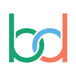

<p align="center">
  
</p>

<h2 align="center">Sistem Informasi Desa untuk Indonesia</h2>

<p align="center">
  <a href="https://bades.id">Situs Web</a>
  |
  <a href="https://bades.id/kontak">Hubungi Kami</a>
</p>

<br />

# Tentang Bades.id

Bades.id adalah Sistem Informasi Desa (SID) yang dirancang untuk pekerjaan
sehari-hari perangkat desa di Indonesia. Bades.id membantu balai desa mengelola
data warga, layanan surat, keuangan desa, program bantuan sosial, serta aset
dan kelembagaan desa dalam satu sistem yang mudah digunakan.

Bades.id disediakan sebagai **layanan terkelola**. Tim balai desa cukup memakai
produknya untuk tugas administrasi, tanpa perlu mengurus server, pemasangan,
atau pemeliharaan teknis.

<br />

# Mulai Menggunakan

Cara tercepat untuk memulai adalah mendaftar di [bades.id](https://bades.id).
Workspace desa Anda siap dalam hitungan menit, selalu diperbarui, dan tidak ada
infrastruktur yang perlu Anda kelola sendiri.

<br />

# Yang Anda Dapatkan

Bades.id menyatukan tugas administrasi desa ke dalam beberapa domain utama:

Workspace standar Bades datang dengan **9 object inti SID** sesuai format
dokumen resmi (Permendagri 109/2019, 12/2007, 47/2016, 67/2017, 1/2016 dan
UU 6/2014) plus dua object generik bawaan (Catatan, Tugas) yang bisa
ditempel ke mana saja:

- **Penduduk** - data warga lengkap mengikuti KTP-el.
- **Keluarga** - data per Kartu Keluarga.
- **Wilayah** - hierarki Dusun, RW, dan RT desa.
- **Layanan** - alur permohonan surat dan layanan dari warga.
- **Surat** - arsip surat masuk dan keluar dalam satu tempat.
- **Perangkat Desa** - penduduk yang sedang atau pernah menjabat.
- **Program Bantuan** - PKH, BLT-DD, BPNT, RTLH, PIP, KIS, dan program
  sosial lain.
- **Penerima Bantuan** - daftar warga atau keluarga penerima per program.
- **Aset Desa** - aset bergerak dan tak bergerak milik desa.

Setiap desa mendapat dashboard, peran pengguna, dan alur kerja yang dapat
disesuaikan dengan kebutuhan administrasinya. Object lain seperti APBDes,
Posyandu, UMKM, Bidang Tanah, atau Kegiatan Desa tersedia sebagai modul
kustom per implementasi klien, bukan beban default semua workspace.

<br />

---

# Catatan Internal

Bagian ini ditujukan untuk tim pengembang internal Bades dan bukan untuk
audiens umum. Repositori ini adalah repo privat tim Bades; bukan distribusi
open-source atau proyek komunitas. Kontribusi dari luar tim tidak dibuka.

## Stack Teknologi

- TypeScript
- Nx (monorepo)
- NestJS, BullMQ, PostgreSQL, Redis
- React, Jotai, Linaria

## Deploy via Docker

Semua artefak Docker tinggal di root repo: `Dockerfile`,
`docker-compose.yml` (server + worker + Postgres + Redis), `Makefile`,
`entrypoint.sh`, dan `.env.example`.

### Lokal — build & run image produksi

```bash
# Bangun image
make prod-build

# Run stack lengkap (server + worker + db + redis)
cp .env.example .env  # isi APP_SECRET, ENCRYPTION_KEY, dll
docker compose up -d

# Cek health
curl http://localhost:3000/healthz
```

### Lokal — hanya Postgres + Redis (development against source)

```bash
# Hidupkan hanya service db + redis dari compose root
docker compose up -d db redis
# lalu jalankan server + front dari source seperti biasa:
bun start
```

### Production deploy

Workflow `.github/workflows/build-image.yaml` build satu image dan push ke
GHCR (`ghcr.io/<owner>/bades`). Image yang sama dipakai oleh service
`server` (server + frontend) dan service `worker` (override command jadi
`bun run worker:prod`). Pola: satu image runtime + Postgres + Redis. Cocok
untuk platform managed (Railway, Render) maupun host Docker mandiri.

Repo ini tidak memaketkan workflow deploy ke server tertentu; operator
internal memilih platform sendiri.

Panduan operasional internal: [`.github/DEPLOY.md`](./.github/DEPLOY.md).
